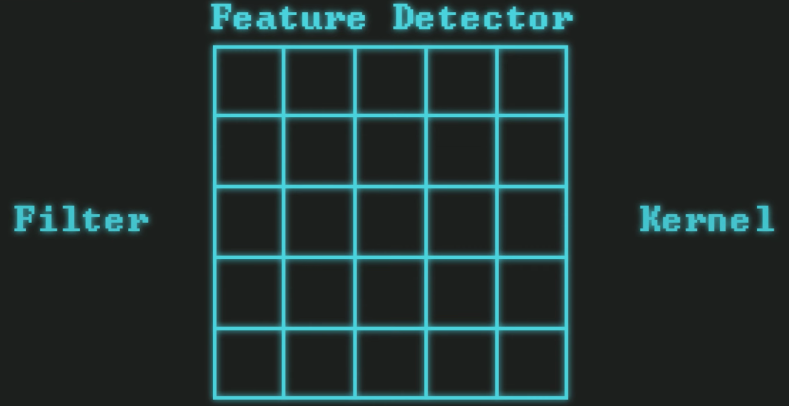

# IMAGE CLASSIFICATION BASICS

## Image Classification in the Context of Machine Learning

### The Field of Vision / Graphics
- Image Classification
- Object Detection
- Object Segmentation
- Pose Detection
- Face Recognition
- Image Inpainting
- Face Generation

## A bit of theory

Image classification involves two primary steps: `feature detection` and `classification`.

**Feature detection** can be efficiently performed using Convolutional Neural Networks (CNNs), which automatically detect important features without any human supervision. CNNs are designed to process data in the form of multiple arrays, ideal for image data, by applying filters to recognize patterns, edges, and textures.
The **classification** step often utilizes a feedforward network with dense nodes, known as a Fully Connected Layer (FCL), to classify the image into various categories based on the detected features. The FCL takes the high-level features identified by the CNN and combines them to make a final prediction.

For a detailed understanding, TensorFlow's tutorials provide a comprehensive guide on using CNNs for image classification: [TensorFlow Tutorials](https://www.tensorflow.org/tutorials/images/classification).

Additionally, the concept of feature detection and classification is well-detailed in the academic literature, such as the seminal paper by Krizhevsky et al., "ImageNet Classification with Deep Convolutional Neural Networks", available on [Neural Information Processing Systems](https://papers.nips.cc/paper_files/paper/2012/file/c399862d3b9d6b76c8436e924a68c45b-Paper.pdf).

## Features
In the context of Convolutional Neural Networks (CNNs) used for image processing, features can be categorized into three levels based on their complexity and abstraction: low-level, mid-level, and high-level features.

### Low-Level Features

Low-level features are the basic building blocks of an image, typically captured in the initial layers of a CNN. These features include edges, corners, colors, and textures. They are straightforward, simple patterns that do not convey much about the content of the image but are crucial for the initial stage of processing. For example, detecting the boundaries and basic shapes within an image falls under low-level feature detection.

### Mid-Level Features

As we move deeper into the network, the CNN starts to combine low-level features to form mid-level features. These features represent more complex patterns that can be interpreted as parts of objects within the image, such as wheels, windows (in the context of vehicles), or eyes and mouths (in the context of faces). Mid-level features bridge the gap between simple patterns and the recognition of whole objects, capturing the essence of object parts without identifying the object as a whole.

### High-Level Features

High-level features are detected in the deeper layers of the CNN. These features represent entire objects or even scenes, incorporating a high level of abstraction and complexity. At this stage, the network has combined lower-level features to recognize complex patterns and objects, such as cars, trees, or human faces. High-level features allow the network to make decisions about what is present in the image, leading to classifications or identifications in tasks like image recognition, object detection, and scene understanding.

The progression from low-level to high-level features in a CNN mirrors the way humans visually process information: starting from basic visual cues and moving towards complex interpretations. This hierarchical processing enables CNNs to effectively handle a wide range of image recognition and classification tasks by learning to recognize patterns of increasing complexity.

## Filter / Feature Detector / Kernel
In the context of Convolutional Neural Networks (CNNs), the terms filter, feature detector, and kernel are often used interchangeably to refer to the same concept. These elements are fundamental to the operation of CNNs, enabling them to perform feature extraction from input images.

**Definition:** A filter (also known as a feature detector or kernel) is a small matrix used to apply transformations to the input image. Filters are designed to detect specific types of features in the image, such as edges, textures, or patterns.

**Operation:** The process of applying a filter to an image is known as convolution. During convolution, the filter is slid (or convolved) across the image, and at each position, a dot product is computed between the filter and the portion of the image it covers. This operation produces a new matrix called a feature map or activation map, which highlights the areas of the image where the specific pattern of the filter is found.

**Purpose:** Filters are used to extract various features from the input image, making it easier for the network to understand and interpret the image. By applying multiple filters, a CNN can detect a wide range of features at different levels of abstraction, from simple edges to complex objects.

**Learning:** In modern CNNs, the values within these filters are not hand-engineered but learned automatically during the training process. The network adjusts the values of the filters based on the training data, enabling it to learn the most relevant features for the task at hand, whether it be image classification, object detection, or another image-related task.

**Depth:** In deep learning, a CNN can have multiple layers of convolution, each with its own set of filters. The filters in the initial layers tend to detect low-level features (such as edges and textures), while the filters in deeper layers are capable of detecting higher-level features (such as parts of objects or entire objects).

By using filters, CNNs can progressively extract more meaningful and complex features from raw pixel data, which is crucial for performing various vision-based tasks with high accuracy. This mechanism allows CNNs to build a deep understanding of images, making them powerful tools for image analysis and interpretation.